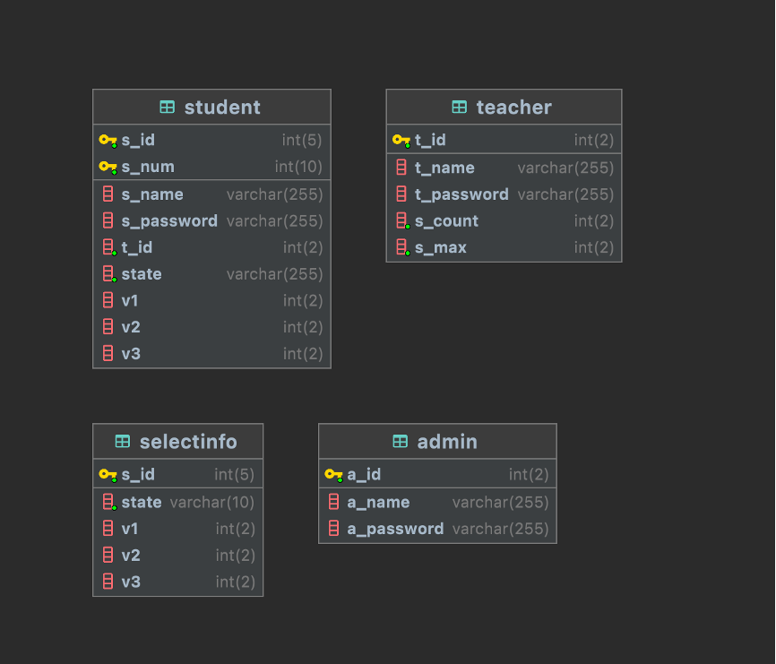

# 使用SSM框架技术实现一个基于Web应用的《本科生毕业设计选导师系统》

## 系统功能描述：
1. 使用系统的角色有2类：用户（学生、老师）、管理员； 
2. 用户（老师，学生）首先需要进行注册，注册成功后可以使用注册账号登陆系统，管理员默认账号admin，密码为admin123； 
3. 管理员可以添加学生，老师；删除学生、老师；设置志愿选择的时间。 
4. 学生用户可以进行选择第一、二、三志愿的导师，老师用户可以在学生选完志愿的时间之后选择或者放弃选择自己的学生。 
5. 学生最后可以查看自己分配到哪个导师，导师也可以看到选择自己的学生都有谁。

## 系统架构设计

## 数据库设计

## 描述
功能非常简单，这仅仅只是作为软件架构设计平台的一次课程作业，没有花上太多心思，希望可以作为一些参考。